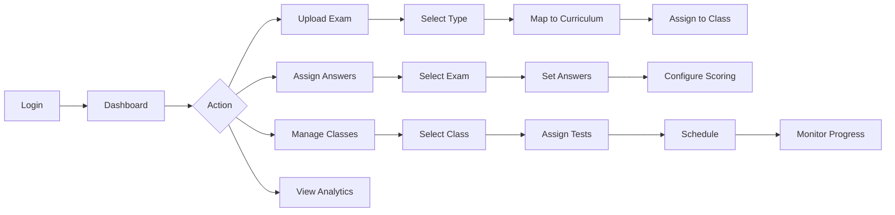
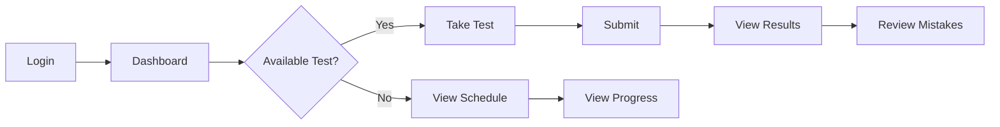

# Product Requirements Document (PRD)
# PrimePath Routine Test System - Phase 2

**Version:** 1.0  
**Date:** August 13, 2025  
**Status:** Draft for Review

---

## 1. EXECUTIVE SUMMARY

### 1.1 Product Overview
PrimePath Routine Test System is a comprehensive assessment platform designed for regular student evaluation, progress tracking, and performance analytics throughout the academic year.

### 1.2 Key Distinction from Phase 1
- **Phase 1 (Placement Test)**: One-time assessment for initial level placement
- **Phase 2 (Routine Test)**: Recurring assessments for continuous evaluation and progress tracking

### 1.3 Core Value Proposition
Enable teachers to efficiently create, assign, and track regular assessments while providing students with continuous feedback on their learning progress.

---

## 2. SYSTEM ARCHITECTURE

### 2.1 Module Independence
- **Placement Test Module** (Phase 1): Standalone system with separate database
  - Single admin account
  - No student accounts required
  - Independent exam database
  
- **Routine Test Module** (Phase 2): Multi-tier access system
  - Three-tier access: Admin → Teachers → Students
  - Shared curriculum structure with Phase 1
  - Independent user management and test database

### 2.2 User Hierarchy
```
Admin (Super User)
├── Manages all teachers
├── Assigns teachers to classes
├── System configuration
│
Teachers
├── Upload and manage exams
├── Manage assigned classes
├── Assign tests to students
├── View analytics
│
Students
├── Take assigned tests
├── View results
└── Track progress
```

---

## 3. CORE FEATURES

### 3.1 Upload Exams Module

#### Workflow
1. **File Upload**
   - PDF exam papers
   - Audio files for listening sections
   - Support for multiple file formats

2. **Exam Classification**
   - **Test Type Selection**:
     - Review Test → Select Month (January-December dropdown)
     - Quarterly Exam → Select Quarter (Q1-Q4 dropdown)

3. **Curriculum Mapping**
   - **Program Selection**: CORE, ASCENT, EDGE, PINNACLE
   - **SubProgram & Level**:
     - CORE: Phonics, Sigma, Elite, Pro (Levels 1-3)
     - ASCENT: Nova, Drive, Pro (Levels 1-3)
     - EDGE: Spark, Rise, Pursuit, Pro (Levels 1-3)
     - PINNACLE: Vision, Endeavor, Pro (Levels 1-2)

4. **Class Assignment**
   - Teacher sees only assigned classes
   - Select target class from dropdown
   - Admin controls teacher-class relationships

5. **Automatic Naming Convention**
   ```
   Format: [TEST_TYPE | PERIOD] - PROGRAM SubProgram Level X - ClassCode_CustomDescription
   Example: [REVIEW | January] - CORE Pro Level 2 - CLS101_MidtermReview
   ```

6. **Exam Configuration**
   - Duration setting (minutes)
   - Number of questions
   - MCQ options (global setting)
   - Pass/fail thresholds

#### Key Features from Phase 1 to Retain
- PDF viewer with rotation controls
- Audio file management and tagging
- Question-audio mapping interface
- Multi-format answer support

---

### 3.2 Assign Answers Module

#### Features (Inherited from Phase 1)
- Modular exam card view
- PDF preview with navigation
- Audio assignment per question
- Multiple answer formats:
  - Multiple choice (A-E options)
  - Short answer text
  - Numeric responses
  - True/False

#### Enhancements for Phase 2
- Batch answer import
- Answer key templates
- Question difficulty tagging
- Point value assignment per question
- Partial credit options

#### Restrictions
- Exam name editing limited to custom description only
- Cannot modify auto-generated naming components
- Delete requires confirmation and archival

---

### 3.3 Class Management Module

#### Class Overview (Card View)
Each class card displays:
- Class code and name
- Number of enrolled students
- Active teacher(s)
- Recent test completion rate
- Average class performance
- Upcoming tests count

#### Detailed Class View

**Left Panel - Student Management**
- Student cards with:
  - Name and ID
  - Recent test scores
  - Performance trend (↑↓→)
  - Last active date
  - Attendance rate
- Actions:
  - Add/remove students
  - Transfer to another class
  - Individual test assignment
  - View detailed profile

**Right Panel - Test Management**
Two-tab structure:

**Review Tests Tab**
- Monthly organization (Jan-Dec)
- For each month:
  - Available exams list
  - Start/Stop buttons
  - Schedule settings
  - Results summary

**Quarterly Exams Tab**
- Quarterly organization (Q1-Q4)
- For each quarter:
  - Exam list
  - Activation controls
  - Time windows
  - Performance metrics

#### Test Assignment Options
1. **Class-wide Assignment**: All students take same test
2. **Individual Assignment**: Custom tests per student
3. **Group Assignment**: Subset of students

#### Scheduling Features
- Start date/time setting
- Duration window
- Auto-close after deadline
- Grace period configuration
- Reminder notifications

---

### 3.4 Dashboard Module

#### Teacher Dashboard Components

**Performance Overview**
- Class comparison charts
- Subject-wise performance:
  - Reading Comprehension
  - Vocabulary
  - Listening
  - Grammar
  - Writing
- Time-based trends

**Individual Student Analytics**
- Performance history graph
- Strengths/weaknesses radar chart
- Question-type analysis
- Time management insights
- Improvement recommendations

**Report Generation**
- Automated progress reports
- Parent communication templates
- Excel/PDF export options
- Batch report generation
- Custom report builders

#### Student Dashboard Components
- Upcoming tests calendar
- Recent scores
- Progress tracker
- Performance comparison (class average)
- Study recommendations

---

## 4. USER WORKFLOWS

### 4.1 Teacher Workflow



### 4.2 Student Workflow



---

## 5. AUTHENTICATION & ACCESS

### 5.1 Authentication Methods
- **OAuth Integration**:
  - Kakao Login
  - Google Login
- **Traditional**: Email/Password
- **School SSO**: Integration capability

### 5.2 Role Permissions

| Feature | Admin | Teacher | Student |
|---------|-------|---------|---------|
| System Settings | ✓ | ✗ | ✗ |
| Manage Teachers | ✓ | ✗ | ✗ |
| Upload Exams | ✓ | ✓ | ✗ |
| Assign to Any Class | ✓ | ✗ | ✗ |
| Assign to Own Class | ✓ | ✓ | ✗ |
| View All Analytics | ✓ | ✗ | ✗ |
| View Class Analytics | ✓ | ✓ | ✗ |
| Take Tests | ✗ | ✗ | ✓ |
| View Own Progress | ✓ | ✓ | ✓ |

---

## 6. DATA STRUCTURE

### 6.1 Core Entities

**Exam**
- ID, PDF_file, audio_files[]
- test_type (Review/Quarterly)
- time_period (month/quarter)
- program, subprogram, level
- class_codes[]
- created_by (teacher)
- duration, question_count
- custom_description

**TestSession**
- ID, exam_id, student_id
- scheduled_start, actual_start
- scheduled_end, actual_end
- status (scheduled/active/completed)
- answers[], scores[]
- attempt_number
- completion_percentage

**Class**
- ID, code, name
- teacher_ids[]
- student_ids[]
- academic_year
- created_date

**Analytics**
- student_id, test_sessions[]
- performance_metrics{}
- trend_data[]
- strengths[], weaknesses[]

---

## 7. TECHNICAL SPECIFICATIONS

### 7.1 Performance Requirements
- Support 1000+ concurrent users
- Page load time < 2 seconds
- Auto-save every 30 seconds during tests
- Real-time progress sync
- 99.9% uptime SLA

### 7.2 Database Design
- PostgreSQL for production
- Separate schemas for placement vs routine tests
- Data retention: 3 years minimum
- Daily automated backups
- Point-in-time recovery capability

### 7.3 Frontend Technologies
- Responsive design (Bootstrap/Tailwind)
- React/Vue for interactive components
- PDF.js for document viewing
- Chart.js for analytics visualization
- WebSocket for real-time updates

### 7.4 Backend Architecture
- Django REST Framework
- Celery for async tasks (grading, reports)
- Redis for caching and sessions
- S3/CloudStorage for file storage
- API versioning support

---

## 8. IMPLEMENTATION PHASES

### Phase 2.1: Foundation (Weeks 1-2)
- [ ] Copy Phase 1 codebase
- [ ] Rename placement_test app to routine_test
- [ ] Implement 3-tier authentication
- [ ] Create Class model and management
- [ ] Basic teacher-student relationships

### Phase 2.2: Core Features (Weeks 3-4)
- [ ] Upload Exams with new classification
- [ ] Assign Answers module adaptation
- [ ] Class Management interface
- [ ] Test scheduling system
- [ ] Student test-taking interface

### Phase 2.3: Analytics (Weeks 5-6)
- [ ] Individual performance tracking
- [ ] Class-level analytics
- [ ] Report generation
- [ ] Dashboard visualizations
- [ ] Export capabilities

### Phase 2.4: Polish & Enhancement (Weeks 7-8)
- [ ] Notification system
- [ ] Mobile optimization
- [ ] Batch operations
- [ ] Advanced scheduling
- [ ] Parent portal (optional)

---

## 9. SUCCESS METRICS

### Usage Metrics
- 80% teacher adoption rate
- 90% test completion rate
- Average 3+ tests per student/month
- < 5% technical support tickets

### Performance Metrics
- 30% improvement in student scores over semester
- 50% reduction in grading time
- 95% accuracy in auto-grading
- 90% user satisfaction rating

### Business Metrics
- Cost per student < $X/month
- Teacher time saved: 10 hours/month
- Parent engagement rate > 60%

---

## 10. RISKS & MITIGATION

| Risk | Probability | Impact | Mitigation Strategy |
|------|------------|--------|-------------------|
| Teacher resistance to new system | Medium | High | Training programs, gradual rollout |
| Student cheating | Medium | Medium | Question randomization, time limits, proctoring |
| Data loss | Low | Critical | Real-time backups, redundancy |
| Performance issues during tests | Low | High | Load testing, auto-scaling |
| Integration with existing systems | Medium | Medium | API standards, documentation |

---

## 11. CONSTRAINTS & ASSUMPTIONS

### Constraints
- Must reuse 70% of Phase 1 code
- 8-week development timeline
- Limited to web platform initially
- Must support Korean and English

### Assumptions
- Teachers have basic computer skills
- Students have device access
- Stable internet connectivity
- School admin support

---

## 12. FUTURE ENHANCEMENTS (Phase 2.5+)

### Near-term (3-6 months)
- Mobile applications
- Offline test capability
- AI-powered question generation
- Adaptive testing

### Long-term (6-12 months)
- Video explanations
- Peer collaboration tools
- Gamification elements
- Predictive analytics
- Parent mobile app

---

## 13. APPENDICES

### A. Reusable Components from Phase 1
- Authentication system (modify for multi-tier)
- PDF viewer with rotation
- Audio player module
- Timer functionality
- Question display components
- Answer input widgets
- Database models (adapt for routine tests)
- API structure
- Admin interface patterns

### B. New Components for Phase 2
- Class management system
- Teacher-student relationships
- Test scheduling engine
- Progress tracking database
- Analytics calculations
- Report templates
- Notification service
- Dashboard visualizations

### C. Database Migration Strategy
1. Keep Phase 1 database separate
2. Create new schema for Phase 2
3. Share only curriculum reference data
4. Independent user management
5. Separate file storage paths

---

## APPROVAL & SIGN-OFF

| Role | Name | Date | Signature |
|------|------|------|-----------|
| Product Owner | | | |
| Tech Lead | | | |
| UX Lead | | | |
| QA Lead | | | |

---

**Document History**
- v1.0 - Initial draft (August 13, 2025)

**Next Steps**
1. Review and approve PRD
2. Create technical specification
3. Design UI mockups
4. Set up development environment
5. Begin Phase 2.1 implementation