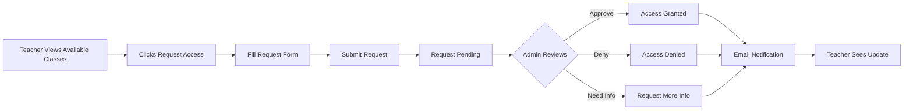

# Teacher Class Access Management - Design Recommendation

**Date**: August 16, 2025  
**Module**: RoutineTest - Teacher Access Management  
**Document Type**: Feature Design & Best Practices Recommendation

---

## 📋 Executive Summary

This document presents a comprehensive design for the Teacher Class Access Management feature, enabling teachers to view their assigned classes and request access to additional classes with admin approval workflow.

---

## 🎯 Feature Requirements (From PRD)

1. **Teachers can see which classes they have access to**
2. **Teachers can request to be assigned to different classes**
3. **Admin approves/denies access requests**
4. **Only assigned teachers can manage specific classes**

---

## 🏆 Best Practices Research

### Industry Standards for Access Management

1. **Role-Based Access Control (RBAC)**
   - Clear separation of permissions
   - Audit trail for all access changes
   - Principle of least privilege

2. **Request-Approval Workflow Patterns**
   - **Ticketing System**: Like IT service desks (ServiceNow, Jira)
   - **Pull Request Model**: Like GitHub (request → review → approve/deny)
   - **Notification-driven**: Real-time alerts for pending requests

3. **UI/UX Best Practices**
   - **Dashboard Pattern**: Overview at a glance
   - **Progressive Disclosure**: Show details on demand
   - **Status Indicators**: Visual feedback for request states
   - **Bulk Actions**: Efficiency for admins

4. **Educational Platform Benchmarks**
   - **Google Classroom**: Simple card-based class display
   - **Canvas LMS**: Detailed permissions matrix
   - **Moodle**: Request-based enrollment system
   - **Blackboard**: Hierarchical access control

---

## 🎨 Recommended UI Layout

### Main Tab: "My Classes & Access"

```
┌─────────────────────────────────────────────────────────────────┐
│  My Classes & Access                                           │
│  ━━━━━━━━━━━━━━━━━━━━━━━━━━━━━━━━━━━━━━━━━━━━━━━━━━━━━━━━━━  │
│                                                                 │
│  [Current Classes (4)] [Available Classes (8)] [My Requests]   │
│                                                                 │
├─────────────────────────────────────────────────────────────────┤
│                                                                 │
│  CURRENT CLASSES ─────────────────────────────────────────────  │
│                                                                 │
│  ┌─────────────────┐ ┌─────────────────┐ ┌─────────────────┐  │
│  │ CLASS 7A        │ │ CLASS 7B        │ │ CLASS 8A        │  │
│  │ 📚 25 Students  │ │ 📚 23 Students  │ │ 📚 28 Students  │  │
│  │ ✅ Full Access  │ │ ✅ Full Access  │ │ ⚠️ View Only    │  │
│  │ Since: Jan 2025 │ │ Since: Jan 2025 │ │ Since: Mar 2025 │  │
│  │                 │ │                 │ │                 │  │
│  │ [Enter Class]   │ │ [Enter Class]   │ │ [View Details]  │  │
│  └─────────────────┘ └─────────────────┘ └─────────────────┘  │
│                                                                 │
│  ┌─────────────────────────────────────────────────────────┐  │
│  │ 📊 Quick Stats                                          │  │
│  │ • Total Students: 76                                    │  │
│  │ • Active Tests: 3                                       │  │
│  │ • Pending Grading: 12                                   │  │
│  │ • Average Performance: 82%                              │  │
│  └─────────────────────────────────────────────────────────┘  │
│                                                                 │
└─────────────────────────────────────────────────────────────────┘
```

### Available Classes Tab

```
┌─────────────────────────────────────────────────────────────────┐
│  AVAILABLE CLASSES TO REQUEST ────────────────────────────────  │
│                                                                 │
│  🔍 Search: [_________________________] [Grade ▼] [Status ▼]  │
│                                                                 │
│  ┌───────────────────────────────────────────────────────────┐ │
│  │ CLASS 9A                                    [Request]     │ │
│  │ Current Teacher: Ms. Johnson | Students: 30 | Grade: 9    │ │
│  │ Curriculum: EDGE Spark Level 2                            │ │
│  └───────────────────────────────────────────────────────────┘ │
│                                                                 │
│  ┌───────────────────────────────────────────────────────────┐ │
│  │ CLASS 9B                                    [Request]     │ │
│  │ Current Teacher: Mr. Smith | Students: 27 | Grade: 9      │ │
│  │ Curriculum: EDGE Rise Level 1                             │ │
│  └───────────────────────────────────────────────────────────┘ │
│                                                                 │
│  ┌───────────────────────────────────────────────────────────┐ │
│  │ CLASS 10A                                   [Pending ⏳]  │ │
│  │ Current Teacher: None | Students: 32 | Grade: 10          │ │
│  │ Request Status: Submitted 2 days ago                      │ │
│  └───────────────────────────────────────────────────────────┘ │
│                                                                 │
└─────────────────────────────────────────────────────────────────┘
```

### My Requests Tab

```
┌─────────────────────────────────────────────────────────────────┐
│  MY ACCESS REQUESTS ──────────────────────────────────────────  │
│                                                                 │
│  Filter: [All ▼] [Pending ▼] [Approved ▼] [Denied ▼]          │
│                                                                 │
│  ┌───────────────────────────────────────────────────────────┐ │
│  │ 🕐 PENDING                                                 │ │
│  ├───────────────────────────────────────────────────────────┤ │
│  │ CLASS 10A - Requested Aug 14, 2025                        │ │
│  │ Reason: "Taking over from retiring teacher"               │ │
│  │ Status: Awaiting admin approval (2 days)                  │ │
│  │ [Withdraw Request]                                        │ │
│  └───────────────────────────────────────────────────────────┘ │
│                                                                 │
│  ┌───────────────────────────────────────────────────────────┐ │
│  │ ✅ APPROVED                                                │ │
│  ├───────────────────────────────────────────────────────────┤ │
│  │ CLASS 8A - Approved Aug 10, 2025                          │ │
│  │ Approved by: Admin Johnson                                │ │
│  │ Note: "Temporary coverage for Ms. Lee"                    │ │
│  └───────────────────────────────────────────────────────────┘ │
│                                                                 │
│  ┌───────────────────────────────────────────────────────────┐ │
│  │ ❌ DENIED                                                  │ │
│  ├───────────────────────────────────────────────────────────┤ │
│  │ CLASS 11B - Denied Aug 5, 2025                            │ │
│  │ Reason for denial: "Class already has 2 teachers"         │ │
│  │ [Request Again]                                           │ │
│  └───────────────────────────────────────────────────────────┘ │
│                                                                 │
└─────────────────────────────────────────────────────────────────┘
```

---

## 🔄 Recommended Workflow

### Teacher Request Flow



### Request Form Modal

```
┌──────────────────────────────────────────────────┐
│  Request Class Access                         X  │
├──────────────────────────────────────────────────┤
│                                                  │
│  Requesting access to: CLASS 9A                 │
│                                                  │
│  Current Teacher: Ms. Johnson                   │
│  Number of Students: 30                         │
│  Curriculum Level: EDGE Spark Level 2           │
│                                                  │
│  ──────────────────────────────────────────────  │
│                                                  │
│  Reason for Request: *                          │
│  ┌──────────────────────────────────────────┐  │
│  │ [Dropdown to select common reasons]      ▼│  │
│  └──────────────────────────────────────────┘  │
│                                                  │
│  □ Substituting for another teacher             │
│  □ Permanent assignment                         │
│  □ Co-teaching arrangement                      │
│  □ Temporary coverage                           │
│  □ Other (specify below)                        │
│                                                  │
│  Additional Notes:                              │
│  ┌──────────────────────────────────────────┐  │
│  │                                          │  │
│  │                                          │  │
│  └──────────────────────────────────────────┘  │
│                                                  │
│  Expected Duration:                             │
│  ○ Permanent                                    │
│  ○ This semester only                          │
│  ○ Specific dates: [___] to [___]              │
│                                                  │
│  [Cancel]                    [Submit Request]   │
│                                                  │
└──────────────────────────────────────────────────┘
```

---

## 👨‍💼 Admin Interface

### Admin Dashboard - Access Requests

```
┌─────────────────────────────────────────────────────────────────┐
│  Access Request Management                    [Refresh] [Export]│
│  ━━━━━━━━━━━━━━━━━━━━━━━━━━━━━━━━━━━━━━━━━━━━━━━━━━━━━━━━━━  │
│                                                                 │
│  🔔 Pending Requests (3)   ✅ Approved Today (2)   📊 Stats    │
│                                                                 │
│  ┌───────────────────────────────────────────────────────────┐ │
│  │ □ | Teacher      | Class    | Date      | Reason | Action │ │
│  ├───────────────────────────────────────────────────────────┤ │
│  │ □ | Ms. Davis    | CLASS 10A| 2 days ago| Cover  | [👁️][✓][✗]│
│  │ □ | Mr. Chen     | CLASS 9B | 1 day ago | Perm   | [👁️][✓][✗]│
│  │ □ | Ms. Wilson   | CLASS 7C | 3 hrs ago | Temp   | [👁️][✓][✗]│
│  └───────────────────────────────────────────────────────────┘ │
│                                                                 │
│  [Select All] [Bulk Approve] [Bulk Deny]                       │
│                                                                 │
└─────────────────────────────────────────────────────────────────┘
```

### Quick Approval Modal

```
┌──────────────────────────────────────────────────┐
│  Review Access Request                       X   │
├──────────────────────────────────────────────────┤
│                                                  │
│  Teacher: Ms. Davis                             │
│  Requesting: CLASS 10A                          │
│  Current Teachers: None                         │
│  Students: 32                                   │
│                                                  │
│  Reason: "Taking over from retiring teacher"    │
│  Duration: Permanent                            │
│  Submitted: Aug 14, 2025 (2 days ago)          │
│                                                  │
│  ──────────────────────────────────────────────  │
│                                                  │
│  Admin Notes (optional):                        │
│  ┌──────────────────────────────────────────┐  │
│  │                                          │  │
│  └──────────────────────────────────────────┘  │
│                                                  │
│  Access Level:                                  │
│  ○ Full Access (manage tests, grades)          │
│  ○ View Only (can view but not edit)           │
│  ○ Co-Teacher (share with current teacher)     │
│                                                  │
│  [Deny]     [Request More Info]     [Approve]   │
│                                                  │
└──────────────────────────────────────────────────┘
```

---

## 🚀 Key Features to Implement

### 1. Smart Request System
- **Auto-approve** for certain scenarios (e.g., no current teacher)
- **Request templates** for common situations
- **Conflict detection** (warn if class already has max teachers)
- **History tracking** of all access changes

### 2. Notification System
- **Real-time notifications** for admins when requests come in
- **Email alerts** for teachers when status changes
- **Dashboard badges** showing pending counts
- **Weekly digest** of access changes

### 3. Access Levels
- **Full Access**: Complete control over class
- **View Only**: Can see but not modify
- **Co-Teacher**: Shared responsibility
- **Temporary**: Time-limited access

### 4. Audit Trail
- **Who** requested/approved
- **When** the action occurred
- **What** was the reason
- **Changes** made to access

### 5. Bulk Operations
- **Batch approve/deny** for efficiency
- **Import/Export** teacher assignments
- **Template assignments** (e.g., all Grade 7 to Teacher X)

---

## 💡 Innovative Features (Thinking Outside the Box)

### 1. Smart Recommendations
```
"Based on your curriculum expertise in EDGE programs, 
 you might want to request access to CLASS 9B (EDGE Rise Level 1)"
```

### 2. Substitute Pool
- Teachers can join a "substitute pool"
- Auto-assign when regular teacher is absent
- Track substitute performance

### 3. Workload Balancing
```
Current Load: 4 classes, 98 students
Recommended Max: 5 classes, 125 students
[Request More] [At Capacity]
```

### 4. Peer Endorsements
- Other teachers can endorse requests
- Builds trust and community
- Helps admin make decisions

### 5. Access Scheduling
- Schedule future access (e.g., "Starting next semester")
- Automatic expiration for temporary access
- Reminder before access expires

---

## 🔐 Security Considerations

1. **Prevent Privilege Escalation**
   - Teachers cannot approve their own requests
   - Cannot modify access levels after approval

2. **Data Privacy**
   - Teachers only see student data for assigned classes
   - Access logs are immutable

3. **Rate Limiting**
   - Limit number of requests per day
   - Prevent spam requests

4. **Approval Chain**
   - Option for multi-level approval for sensitive classes
   - Department head → Principal → Admin

---

## 📊 Database Schema Recommendations

### New Models Needed

```python
class TeacherClassAssignment(models.Model):
    teacher = ForeignKey(Teacher)
    class_code = CharField(choices=CLASS_CHOICES)
    access_level = CharField(choices=['full', 'view', 'co_teacher'])
    assigned_date = DateTimeField(auto_now_add=True)
    assigned_by = ForeignKey(User)
    expires_on = DateTimeField(null=True, blank=True)
    is_active = BooleanField(default=True)
    notes = TextField(blank=True)

class ClassAccessRequest(models.Model):
    teacher = ForeignKey(Teacher)
    class_code = CharField(choices=CLASS_CHOICES)
    reason = TextField()
    request_type = CharField(choices=['permanent', 'temporary', 'substitute'])
    duration_start = DateField(null=True)
    duration_end = DateField(null=True)
    status = CharField(choices=['pending', 'approved', 'denied', 'withdrawn'])
    requested_at = DateTimeField(auto_now_add=True)
    reviewed_at = DateTimeField(null=True)
    reviewed_by = ForeignKey(User, null=True)
    admin_notes = TextField(blank=True)
    
class AccessAuditLog(models.Model):
    action = CharField(choices=['request', 'approve', 'deny', 'revoke'])
    teacher = ForeignKey(Teacher)
    class_code = CharField()
    performed_by = ForeignKey(User)
    timestamp = DateTimeField(auto_now_add=True)
    details = JSONField()
```

---

## 🎯 Success Metrics

1. **Efficiency Metrics**
   - Average time to approve/deny: < 24 hours
   - Percentage of auto-approved requests: > 30%
   - Bulk operation usage: > 50% of approvals

2. **User Satisfaction**
   - Teacher satisfaction score: > 4.5/5
   - Admin time saved: > 50%
   - Request abandonment rate: < 10%

3. **System Health**
   - No unauthorized access incidents
   - 100% audit trail completeness
   - < 1% error rate in assignments

---

## 📈 Implementation Phases

### Phase 1: Basic Access Management (Week 1-2)
- Current classes display
- Basic request form
- Simple approve/deny

### Phase 2: Enhanced Workflow (Week 3-4)
- Request templates
- Notification system
- Access levels

### Phase 3: Advanced Features (Week 5-6)
- Bulk operations
- Smart recommendations
- Audit trail

### Phase 4: Polish & Optimize (Week 7-8)
- Performance optimization
- UI/UX refinements
- User testing

---

## 🎨 Visual Design Guidelines

### Color Coding
- 🟢 **Green**: Approved/Active classes
- 🟡 **Yellow**: Pending requests
- 🔴 **Red**: Denied/Expired access
- 🔵 **Blue**: Information/Actions
- ⚫ **Gray**: Inactive/Historical

### Icons
- 📚 Classes
- 👥 Students
- ✅ Approved
- ⏳ Pending
- ❌ Denied
- 🔔 Notifications
- 📊 Statistics

### Typography
- **Headers**: Bold, 18-20px
- **Subheaders**: Semi-bold, 14-16px
- **Body**: Regular, 12-14px
- **Captions**: Light, 10-12px

---

## 🏁 Conclusion

This comprehensive Teacher Class Access Management system will:
1. **Streamline** the teacher-class assignment process
2. **Empower** teachers with self-service capabilities
3. **Reduce** admin workload through automation
4. **Maintain** security and proper access control
5. **Provide** transparency through audit trails

The design balances simplicity with functionality, following industry best practices while introducing innovative features specific to educational needs.

---

*Document prepared by: Claude*  
*Date: August 16, 2025*  
*Status: Ready for Review and Implementation Planning*